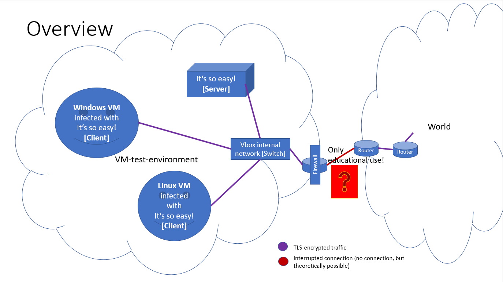
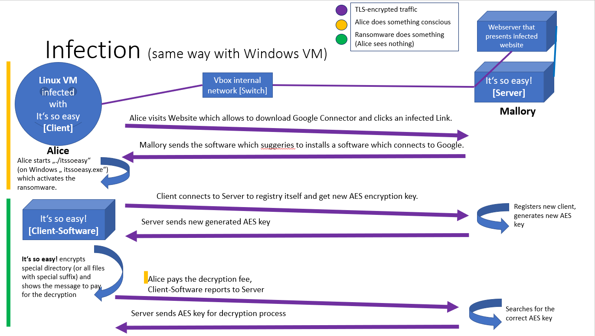
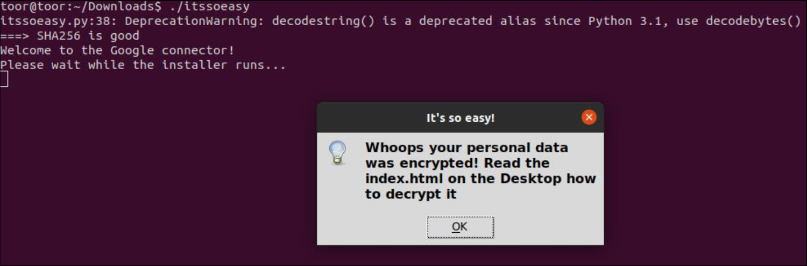
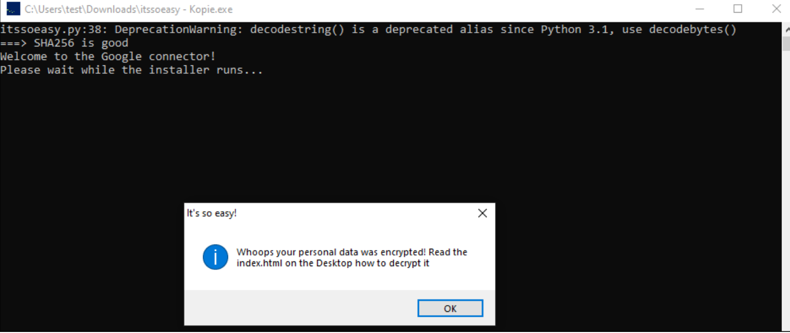
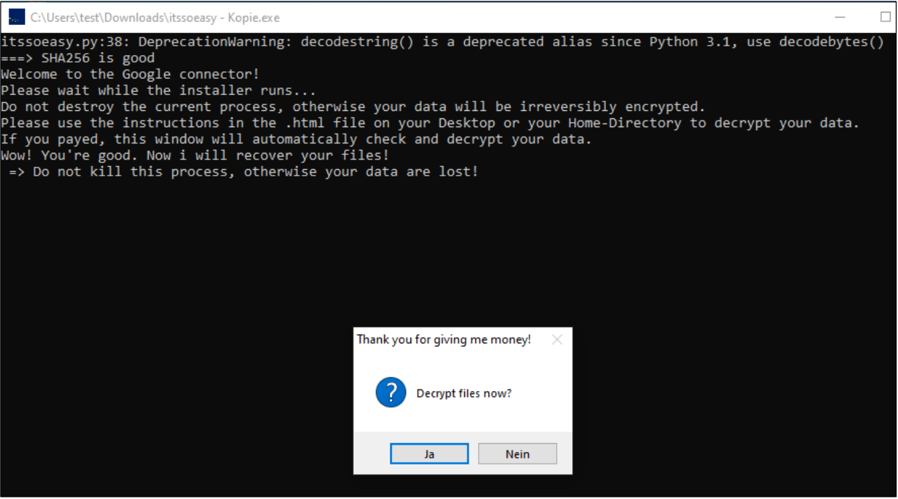

# It's so easy! (Ransomware PoC) 

> ATTENTION! This program code is malicious and can encrypt or/and delete personal data!

#### Disclaimer
> Attention! Use of the code samples and proof-of-concepts shown here is permitted solely at your own risk for academic and non-malicious purposes. It is the end user's responsibility to comply with all applicable local, state, and federal laws. The developer assumes no liability and is not responsible for any misuse or damage caused by this tool and the software in general.

### What?
This is a Ransomware Concept written in Python, Go and C99. Yes it is malicious. Yes, if you do that on VMs it is okay. Yes, if you misconfigured the architecture or network and encrypt your own files they are gone forever. 

### Why?
This PoC I've written for some educational projects. Only for that! And because I am very interested in the topics of how malware is detected and works. :D By the way, on Windows only 4 from 71 AV-Scanners detected the packaged and obfuscated client. On Linux only 1! 
* see: [Virustotal ItsSoEasy Collection](https://www.virustotal.com/gui/collection/2f9db19a09b0bbf638b9ea876dc6f32d0191117f65810906fb2d55e96fbfa410)

### How malicious is it?
Very, by using a alternative hybrid technique! The program uses AES-256 symmetric encrption mode for file encryption. The Keys where sent by the server using TLSv1.{2,3}. The Keys where directly deleted  after (en-) decryption. 


[](https://www.python.org/)
## Setup

* Clone the repo: ``` git clone https://github.com/bstnbuck/ItsSoEasy ```

### Structure
* Python server: `src/server`
</br>

* Python GUI: `src/python-gui`
* Python command line: `src/python-cmd`
* Go: `src/go`
* C99: `src/c99`

<table>
<thead>
<tr>
<th>Python GUI </th>
<th>Python command line</th>
<th>Go </th>
<th>C99 </th>
</tr>
</thead>
<tbody>
<tr>
<td>

#### Requirements
* Python 3.7.9 or higher
* PyInstaller 4.2
* to install the requirements use pip with following command:
	* ```python3 -m pip install -r requirements.txt```
	* installation of Tkinter with Linux or Windows commands

#### Files:
* client.py -> the ransomware client
* setup.py -> the first executed program at packaged state -> starts the client
* server.py -> the server application
* requirements.txt -> all exclusive requirements for the program-code


#### Build
**Client**

``` pyinstaller –-onefile –-uac-admin itssoeasy.py ```

**Server**
* just start on server VM with ```python3 server.py```
</td>

<td>

#### Requirements
* Python 3.9
* PyInstaller 4.2
* to install the requirements use pip with following command:
	* ``` python3 -m pip install -r requirements.txt ```

#### Files:
* client.py -> the ransomware client
* requirements.txt -> all exclusive requirements for the program-code

#### Build
``` pyinstaller –-onefile –-uac-admin itssoeasy.py ```
	  
</td>
     
<td>
	  

#### Requirements
* Go 1.17 and higher

#### Files:
* main.go -> the ransomware client
* helper_\<os>.go -> special syscall functions on each OS

#### Build
* ``` go build . ```

</td>
	  
<td>
	  
#### Requirements
**Windows**
* MinGW-W64 8.1.0 (gcc)

**Linux**
* gcc 10.2.1 or similar

#### Files:
* main.c -> ransomware client
* src/helper.{c,h} -> helper functions
* src/b64.{c,h} -> base64 encode and decode
* src/openssl -> openssl functions needed for Windows statically linking

#### Build
**Windows**

``` gcc main.c src/b64.h src/b64.c src/helper.h src/helper.c src/openssl/ssl.h src/openssl/aes.h src/openssl/libssl.a src/openssl/libcrypto.a src/openssl/libz.a -lws2_32 -lgdi32 -lopengl32 -Wall -o itssoeasy_client_win.exe ```

**Linux**

``` gcc main.c src/b64.h src/b64.c src/helper.h src/helper.c -lcrypto -lssl -Wall -o itssoeasy_client_linux ```
</td>
</tr>
</tbody>
</table>


### System-, Network architecture & Usage (only for educational testing!):
This is the test-environment I've used.

* Server: VBox Debian Linux Buster (Version 10) with 
	* host-only-adapter
	* static ip: paste it into client file
	* for example Apache2 with website for delivery
	* MariaDB (MySQL) 
		* with user root and password toor (or change it :D)
		* database `itsSoEasy` and table `clients`
			* columns:
				* `id` : int, primary key, auto-increment, no-null
				* `userIdentity` : varchar(255), no-null
				* `userKey` : varchar(100), no-null
				* `userIV` : varchar(100), no-null
				* `additional` : varchar(255)
	* itsSoEasy-Server -> `server.py`:
		* port 6666
		* creates logging file
		* needs `certs` folder in the same directory to start TLS-connection

* Client (Python GUI, others may have less functions):
	* NAT (internet and internal ips)
		-> needs no static ip!
	* Ubuntu 20.04 (Focal Fossa), Windows 10
	* for example usage of precompiled binarys:
		* per delivery on website from server
	* >ATTENTION: will encrypt whole Documents or a special directory in it on both os!
	* automatically requests a decryption after several seconds
	* >ATTENTION: debugging will be detected! 
		* At the begin, process list will be analyzed
		* during execution time will be taken, if more than 1,5 seconds 
			programm opens `https://google.de` and kills itself.
			> -> ATTENTION for vboxes with minimal ram or hdd-disks usage
		* if event killed itself, start again, process will do his thing (encryption or decryption)
	* if not payed the ransom, after restart, it starts automatically
	* killing process with `STRG-C` will not work!
	* removes itself and all his created files automatically when procedure is done


### Full Procedure



### Some screenshots while ItsSoEasy (Python-GUI) is in action :D

* A friendly welcome message



* How to pay (opened in default browser)


* The Clou: Is it easy enough for you? ;)
